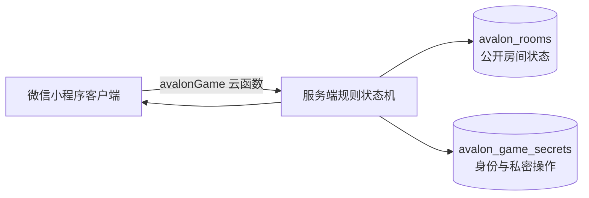

# 《圆桌秘闻》项目进度与后续计划

> 最后更新：2026-08-14  
> 当前阶段：V0.1 Alpha，规则流程原型已基本跑通，尚未达到正式同事局发布标准。

## 1. 项目目标

《圆桌秘闻》是一款配合《亚瑟传奇（Quest）》实体卡牌使用的微信小程序。

它不替代线下讨论和实体桌游，主要负责：

- 多人加入、选择现实座位和私密身份分配。
- 主持身份揭示、首夜、任务、护身符和终局流程。
- 自动校验角色能力、任务牌和操作合法性。
- 记录公开游戏历史，降低主持与记忆成本。
- 后续生成有梗复盘、玩家档案、成就和长期社交数据。

局中产品原则：

- 每位玩家使用自己的手机，不传阅同一台设备。
- 现场嘴炮是主体，小程序只在关键节点要求点选。
- 不要求玩家手写内容；后续整活也以标签和预设选项为主。
- 私密身份、任务票和查验信息必须由服务端按玩家视角返回。

## 2. 已确定的规则与产品决策

| 项目 | 当前决定 |
|---|---|
| 支持人数 | 5-10 人，暂不开放 4 人局 |
| 规则版本 | 不提供“导演剪辑版”选项，任务人数采用完整说明书基础面板 |
| 保护轮 | 仅 7 人及以上的第 4 轮为保护轮，需要至少 2 张失败牌 |
| 角色配置 | 默认使用对应人数的官方基础配置，房主可按阵营自定义 |
| 扩展角色 | 基础与扩展角色统一按正义/邪恶阵营选择，并显示技能与适用人数 |
| 未知角色 | 作为高级开关；房主可多选候选角色，开局按阵营名额随机抽取，摩根勒菲不可移除 |
| 桌型 | 默认长桌，也支持圆桌；长桌按上、右、下、左四条边分配座位 |
| 加入方式 | 当前使用 6 位房间号；扫码加入暂不作为近期必做项 |
| 队长 | 担任过队长的玩家不再允许接任，不额外展示“退伍”文字标记 |
| 魔法指示物 | 只能交给本轮同行骑士，任务牌按角色能力自动限制 |
| 护身符 | 按说明书指定轮次出现；查验、显示阵营和守卫信息均私密处理 |
| 终局 | 任一阵营任务达到 3 胜后进入 5 分钟讨论，再按盲眼杀手与最终指认规则判定 |
| 测试方式 | 房主可补满测试玩家并代其推进流程，仅用于开发测试 |

## 3. 当前技术架构



### 3.1 小程序端

| 路径 | 职责 |
|---|---|
| `miniprogram/pages/index` | 首页、昵称、创建/加入房间、人数、桌型、角色和变体配置 |
| `miniprogram/pages/room` | 房主与加入者共用的候场页、选座、角色配置查看、开始游戏 |
| `miniprogram/pages/play` | 身份、首夜、任务、投票、护身符、历史记录和终局主流程 |
| `miniprogram/pages/result` | 身份公开、胜负、终局判定和任务档案 |
| `miniprogram/data/roleGuides.js` | 各角色身份页攻略文本 |
| `miniprogram/data/ttsLines.js` | 主持文案、音色建议和首夜指令生成 |
| `miniprogram/utils/game.js` | 客户端角色信息、默认阵容、任务面板和平衡性估算 |
| `miniprogram/utils/tableLayout.js` | 圆桌与长桌座位坐标、桌面比例计算 |
| `miniprogram/utils/roomStore.js` | 云函数调用封装 |

### 3.2 云端

| 路径/资源 | 职责 |
|---|---|
| `cloudfunctions/avalonGame/index.js` | 房间、入座、身份同步、任务、护身符、终局和结果接口 |
| `cloudfunctions/avalonGame/gameCore.js` | 服务端权威规则引擎与角色判定 |
| `avalon_rooms` | 房间配置、座位、公开游戏状态和公开历史 |
| `avalon_game_secrets` | OpenID 绑定、真实身份、私密任务票、查验和终局提交 |

当前绑定：

- AppID：`wx657aadc4dc40357f`
- 云环境：`cloudbase-d6gh6eo4ce2c13e2b`
- 云函数：`avalonGame`

## 4. 当前完成进度

### 4.1 已完成

| 游玩阶段 | 已实现能力 |
|---|---|
| 首页 | 昵称、创建游戏、6 位数字键盘加入游戏 |
| 创建房间 | 全屏配置；5-10 人；长桌/圆桌；长桌四边人数分配 |
| 角色配置 | 官方默认阵容、自定义角色、阵营与人数校验、兰斯洛特成对校验 |
| 平衡预估 | 在角色编辑页展示正义/邪恶倾向和超出推荐区间提示 |
| 未知角色 | 多选候选池并按阵营名额随机抽取，必选角色保留 |
| 多人候场 | 房主与加入者进入同一候场页；所有人选择对应现实座位 |
| 桌面视图 | 圆桌座位正圆排列；长桌按四条边和实际人数调整比例 |
| 候场角色查看 | 按正义/邪恶列表展示本局候选角色、数量和技能 |
| 身份揭示 | 全员准备、倒计时统一揭示、统一阅读时长、记住身份确认 |
| 私密信息 | 每人仅看到自己的角色、阵营、额外信息和角色攻略 |
| 首任骗徒 | 仅在骗徒恰好担任首任队长时选择对教士展示的阵营 |
| 首夜 | 独立仪式阶段、主持指令页面、角色组合对应的首夜文本 |
| 任务面板 | 5 轮任务人数、当前比分和保护轮状态 |
| 队长组队 | 当前队长全屏选择同行骑士，人数由服务端校验 |
| 魔法指示物 | 仅能选择同行骑士；提交时播放状态动画和振动 |
| 私密投票 | 上车玩家在自己的手机提交，其他人只看到提交进度和总票数 |
| 角色出牌限制 | 正义、邪恶、摩根、侍从、疯子、野蛮人、不情愿领袖、破坏者等按服务端规则限制 |
| 任务结算 | 自动统计成功/失败、保护轮判定、翻牌动画和比分更新 |
| 皇冠交接 | 队长选择合法继任者，阻止重复担任队长 |
| 护身符 | 分配、合法对象校验、被查者显示阵营选择、守卫首次同步结果 |
| 公开历史 | 查看每轮队长、车队、魔法对象、票数和护身符流转 |
| 终局 | 5 分钟讨论、盲眼杀手、猎杀投票变体、叛徒选择和全员最终指认 |
| 终局修正 | 公爵、大公、学徒、揭露者和叛徒转换纳入服务端判定 |
| 结果页 | 胜方、任务比分、全员身份、终局结果和逐轮任务档案 |
| 同步体验 | 关键点击先本地反馈；写入期间防止旧轮询覆盖新状态 |
| 基础动效 | 选人、魔法、皇冠、护身符、任务翻牌、终局过场和结果揭示 |

### 4.2 部分完成

| 模块 | 当前状态 | 尚缺内容 |
|---|---|---|
| AI 主持 | 主持文本、音色说明和阶段占位已存在 | 尚未接入实际 TTS/BGM 音频和播放控制 |
| 美术 | 已用 CSS 形状和文字占位保证流程可用 | 尚无正式背景、桌面、卡牌、头像、图标和结算资产 |
| 角色能力 | 大部分角色信息与核心判定已实现 | 吹嘘者第 5 轮队长公开身份、兰斯洛特现实睁眼仪式仍需补齐与确认 |
| 多人同步 | 云函数、事务、轮询和乐观反馈已实现 | 尚缺多台真机完整局、弱网、切后台和断线恢复验证 |
| 复盘 | 结果页生成结构化模板总结 | 尚未接入 AI 长复盘、短战报、标签和分享图 |
| 测试工具 | 可补测试玩家、自动身份确认、自动护身符和任务投票 | 正式体验版需要隐藏或隔离这些入口 |

### 4.3 尚未开始

- 赛后玩家标签、MVP、背锅指数、名场面等有梗选择。
- AI 长版复盘、微信群短战报、多风格复盘和分享图片。
- 玩家账号档案、历史局数、阵营/角色胜率。
- 成就、奖杯墙、金币和秘密角色心愿。
- 宿敌、铁搭档、毒奶关系和年度圆桌奖。
- 正式房间二维码/小程序码加入。
- 运营后台、异常监控、数据统计和内容安全策略。

## 5. 当前已发现的问题

### 5.1 发布阻塞问题（P0）

| 问题 | 影响 | 建议处理 |
|---|---|---|
| 正式美术和音频缺失 | 当前仍明显像功能原型，仪式感不足 | 先完成 P0 视觉资产和首夜/关键阶段音频接入 |
| 真机多人覆盖不足 | 单机测试玩家无法暴露多 OpenID、弱网、切后台和并发问题 | 至少完成 5、6、8、10 人各一局真机测试 |
| 部分扩展角色流程未闭环 | 特定阵容可能与说明书不一致 | 优先确认并实现吹嘘者、兰斯洛特首夜和不情愿领袖边界 |
| 数据库权限仍依赖手工配置 | 配错 `avalon_game_secrets` 会造成严重泄密 | 发布前审计安全规则；两个集合均只允许云函数访问更稳妥 |

已在 2026-08-14 修复（见 commit `b26bcae`）：

| 原问题 | 现在的处理 |
|---|---|
| 测试玩家入口直接可见 | 房间创建时固定 `devMode`，服务端拒绝非开发房间的一切测试玩家操作，界面同步隐藏入口 |
| 客户端用名字前缀识别机器人 | 服务端 `publicPlayer` 下发 `bot` 字段，客户端不再依赖「测试骑士」字符串 |
| 错误弹窗直接展示底层错误 | 规则错误原样透出，其余错误在云端记完整日志并返回带 trace id 的简短文案 |
| 房间号没有唯一性检查 | 创建时查重并重试，最多 8 次 |
| 房间没有过期与清理机制 | 房间写入 `expiresAt`（12 小时），加入时只匹配有效房间，并区分「过期」与「不存在」 |
| 切后台/断线重连不完整 | 候场页与对局页增加 `onShow` 立即拉取、`onHide` 停止轮询、房间失效提示并返回首页 |

### 5.2 体验与性能问题（P1）

| 问题 | 当前表现 | 后续方向 |
|---|---|---|
| 状态同步依赖轮询 | 候场约 1.2 秒、游戏约 0.9 秒一次，其他玩家会感到延迟 | 评估公开状态实时监听；保留云函数处理私密信息和写入 |
| 轮询产生持续云调用 | 人数增加后读取次数和费用会线性上升 | 阶段自适应频率、页面不可见时暂停、无变化使用版本号 |
| 切后台/断线重连不完整 | 回到小程序后依赖下一次轮询恢复 | 增加 `onShow` 立即拉取、房间失效提示和重新绑定流程 |
| 角色候选很多时信息密度高 | 清单需要局部滚动 | 增加基础/扩展过滤或折叠，但保持技能直接可见 |
| 创建页配置仍偏长 | 小屏设备需要滚动 | 后续考虑拆为“基础设置/角色设置”两个全屏步骤 |
| 终局 5 分钟测试成本高 | 自动化流程耗时长 | 测试环境允许强制跳过，正式环境保持规则时长 |

### 5.3 技术债务（P1/P2）

| 问题 | 风险 | 建议 |
|---|---|---|
| 客户端与服务端各维护一份角色和任务配置 | 两边修改不同步会导致界面允许、服务端拒绝 | 抽成共享纯 JS 包，或由云端下发带版本的规则配置 |
| `avalonGame/index.js` 和 `play.wxss` 体积持续增大 | 后续 V0.2 很难维护和回归 | 按房间、任务、护身符、终局拆模块；样式按阶段拆分 |
| `miniprogram/pages/game` 是旧单机页面且未注册 | 容易误读和误改 | 确认无引用后删除 |
| AppID 与云环境写死在项目文件 | 切开发/体验/正式环境容易出错 | 增加环境配置文件和部署检查脚本 |
| 旧产品和部署文档已有失效内容 | 继续按旧文档操作会产生错误配置 | 以本文件为状态入口，后续同步修订旧文档 |
| 项目尚未建立 Git 基线 | 当前文件基本都处于未跟踪状态，无法可靠回滚 | 清理缓存与临时目录，补 `.gitignore`，建立首个可运行提交 |
| 缺少结构化日志和版本字段 | 云端问题难以定位，旧房间兼容困难 | 增加 `schemaVersion`、`gameVersion`、操作日志和 trace ID |

## 6. 下一步 TODO

### P0：形成可带同事玩的 V0.1 Beta

- [ ] 与说明书再次确认吹嘘者、兰斯洛特现实相认、不情愿领袖不上车等边界规则。
      （2026-08-14 产品方确认：这几个角色实际很少用到，排到流程之后再处理。）
- [ ] 补齐仍缺少的角色流程，并增加对应服务端测试。
- [x] 确认终局判定：邪恶方三次任务成功后，盲眼杀手猎杀失败即判正义方获胜。
      产品方 2026-08-14 确认符合预期——盲眼担心邪恶暴露过于明显而选择刺杀时，
      胜负就直接由刺杀结果决定，不再经过最终指认。当前实现无需修改。
- [ ] 接入首夜完整 TTS+BGM 音频，支持播放、暂停、跳过和播放失败降级。
- [ ] 按 [生图工作手册.md](../assets/生图工作手册.md) 生成第一批美术。
- [ ] 出图前先把任务牌翻面动画从双面 3D 翻转改成两段 `scaleX`，
      否则换成图片后正反面叠加会比现在的文字占位更明显。
- [ ] 完成多真机端到端测试矩阵并记录结果。
- [ ] 收紧并复查两个数据库集合的访问权限。
- [ ] 为 `avalon_rooms.code` 建立数据库索引，并增加过期房间的定时清理。
- [x] 将“补满测试玩家”“测试玩家自动投票”限制在开发模式。
- [x] 修复房间码碰撞、旧房间命中和数据过期问题。
- [x] 收敛前端错误文案，保留可排查的云端日志。
- [x] 增加 `onShow` 重连、房间不存在/已结束处理和切后台恢复。
- [x] 清理仓库、增加 `.gitignore` 并建立 Git 初始基线。

### P0 补充：围绕「线下辅助工具」定位的体验优化

产品定位已明确：**小程序只负责身份查看、投票、查验的便利，以及这些信息的留存可随时查看；
大部分时间玩家在线下嘴炮。** 因此仪式感与沉浸式动画整体降级，凡是打断线下讨论的都要收敛。

- [x] 「我的密录」：对局中随时回看自己的身份、阵营、首夜信息、查验结果与出牌记录。
      此前身份牌只在开局 40 秒渲染，护身符查验结果只出现一次，连查验者本人事后都查不到。
- [x] 常驻「现在等谁」：按阶段点名尚未操作的玩家，解决全场互相张望。
- [x] 首夜改为房主逐条推进（此前是 5 秒定时自动跳过，且分角色首夜脚本从未被渲染）。
- [x] 皇冠、护身符、火球降级为顶部横幅，不再全屏打断讨论。
- [x] 仪式遮罩不透明度 0.84 → 0.97。
- [ ] 主操作区下沉到拇指可达区域（当前内容顶部对齐，下方约 40% 是空白）。
- [ ] 把 emoji 图标换成正式美术资源（等生图；不做 SVG 中间态）。

### P1：V0.1 正式可用与体验打磨

- [ ] 优化轮询策略或引入公开状态实时监听。
- [ ] 对 5-10 人、圆桌/长桌、小屏/大屏做视觉截图回归。
- [ ] 完成全部关键状态的加载、空态、失败重试和重复点击保护。
- [ ] 清理未注册旧页面，拆分超大样式和云函数模块。
- [ ] 增加房间与规则版本字段，准备后续数据迁移。
- [ ] 补充体验版发布清单、云函数部署检查和回滚说明。
- [ ] 决定房间二维码是否进入 V0.1 正式版，房间号仍保留兜底。

### 需要产品方提供或确认

- [ ] 按 [生图工作手册.md](../assets/生图工作手册.md) 生成并筛选首批图片。
- [ ] 按 [TTS主持文本与音色建议.md](../assets/TTS主持文本与音色建议.md) 合成首夜和关键阶段音频。
- [ ] 确认扩展角色剩余规则边界和实际采用的村规。
- [ ] 组织一次 5-10 位同事的完整真机试玩，记录卡点、误触和规则争议。
- [ ] 确认 V0.2 的整活标签边界，避免同事局玩笑过界。

## 7. 版本迭代计划

### V0.1 Alpha：规则原型（当前）

目标：证明多人身份隔离、任务状态机、护身符和终局能够工作。

当前结论：主体已实现，仍需角色补漏、真机验证、正式音频、美术和发布级稳定性。

### V0.1 Beta：同事局可玩版

目标：一桌玩家无需开发者介入，可以稳定完成一整局。

验收标准：

- 5-10 人主要配置均可从创建房间玩到结果页。
- 每位玩家只看到自己应看到的信息。
- 弱网、切后台和重复点击不会破坏房间状态。
- 房主无需翻说明书即可完成主持。
- 首夜音频与关键视觉资产可正常播放和降级。
- 正式界面不出现测试玩家控制。

### V0.2：圆桌秘史版

目标：在不增加手写负担的情况下，让赛后更好笑、更值得分享。

计划功能：

- 开局宣誓、随机封号和房间名。
- 名场面、封神/封棺、背锅指数和预设遗言。
- 赛后玩家标签、正邪 MVP 和败方 MVP。
- AI 长复盘、微信群短战报、多风格文案。
- 分享战报图和结算盖章。

前置条件：V0.1 事件日志结构稳定，否则 AI 复盘和成就无法可靠计算。

### V0.3：骑士生涯版

目标：把单局体验沉淀为长期玩家档案。

计划功能：

- 骑士生涯、阵营/角色胜率和历史对局。
- 通用成就、角色专属奖杯和奖杯墙。
- 金币获取、消耗和不绑定付费的“命运贿赂”。
- 秘密角色心愿与概率倾向，标准公平局默认关闭。
- 宿敌、铁搭档、毒奶关系和年度圆桌奖。

### V0.4：王国盛典版

目标：增强表现力、运营能力和长期传播。

计划功能：

- 多套主持风格、音效包和主题皮肤。
- AI 角色头像、身份动画和分享模板升级。
- 年度报告、运营后台和内容管理。
- 根据实际使用数据决定是否扩展其他桌游。

## 8. 测试现状与发布检查

### 8.1 已有自动化测试

当前默认测试覆盖：

- 规则引擎与角色配置。
- 长桌/圆桌布局。
- 平衡性估算。
- 创建页与候场页交互。
- 云函数主要动作与非法操作。
- 身份、任务、护身符和终局分支。
- UI 绑定、动效数据和状态同步竞态。

截至 2026-08-14，以下测试均通过：

```text
gameCore.test.js
tableLayout.test.js
balance.test.js
indexConfig.test.js
roomLobby.test.js
cloudFunction.integration.test.js
uiBindings.test.js
uiAnimations.test.js
stateSync.test.js
waitingHint.test.js
```

运行方式：`./scripts/run-tests.sh`。本机没有安装系统 Node，脚本会自动回退到微信开发者工具内置的 node（v16）。

### 8.1.1 需要开发者工具的端到端测试

以下两个脚本不在默认测试中，需要开发者工具保持打开并启用自动化端口：

| 脚本 | 用途 |
|---|---|
| `tests/cloud.live.e2e.js` | 校验真实云环境下的并发入座、非法操作和护身符交接 |
| `tests/fullGame.e2e.js` | 驱动模拟器跑完整一局并逐阶段截图，产物在 `tmp/e2e-shots/` |

运行完整对局：`./scripts/run-e2e.sh`（会自动检测并按需开启自动化端口）。

注意：开发者工具运行期间**反复执行 `cli auto` 会让自动化服务卡死**，表现为连接成功但所有调用超时，
此时需要重启开发者工具。另外 `miniprogram-automator@0.12.1` 与当前基础库不完全兼容，
`page.data()`、`page.$$()` 和 automator 自带的导航接口均不可用，需改用 `evaluate`，
详见 `tests/fullGame.e2e.js` 头部说明。

### 8.2 V0.1 Beta 真机测试矩阵

| 维度 | 最低覆盖 |
|---|---|
| 人数 | 5、6、8、10 人 |
| 桌型 | 圆桌、左右长桌、四边长桌 |
| 设备 | iPhone、Android、至少一台小屏设备 |
| 网络 | 同一 Wi-Fi、蜂窝网络、短暂断网恢复 |
| 生命周期 | 切后台、锁屏、重新进入小程序 |
| 身份 | 基础阵容、未知角色、兰斯洛特、骗徒、叛徒、盲眼杀手 |
| 比分 | 正义 3 胜、邪恶 3 胜、保护轮单败和双败 |
| 终局 | 猎杀成功/失败、沉默、猎杀投票、最终指认成功/失败 |
| 护身符 | 普通、捣乱者、骗徒、守卫首次查验 |

## 9. 文档与维护约定

- 本文件作为“当前真实进度”的入口。
- [阿瓦隆2微信小程序产品方案.md](../product/阿瓦隆2微信小程序产品方案.md) 保留长期产品创意，不代表已经实现。
- [阿瓦隆2产品迭代版本计划.md](../product/阿瓦隆2产品迭代版本计划.md) 是早期版本规划，其中导演剪辑版、4 人局和部分范围已经失效。
- [微信小程序多人体验说明.md](../ops/微信小程序多人体验说明.md) 仍可用于部署参考，但扫码加入等描述需要后续修订。
- 每完成一个可体验里程碑，应同步更新本文件的日期、完成表、已知问题和验收结果。
- 规则变更必须同时更新客户端展示、服务端规则、角色攻略和自动化测试。

